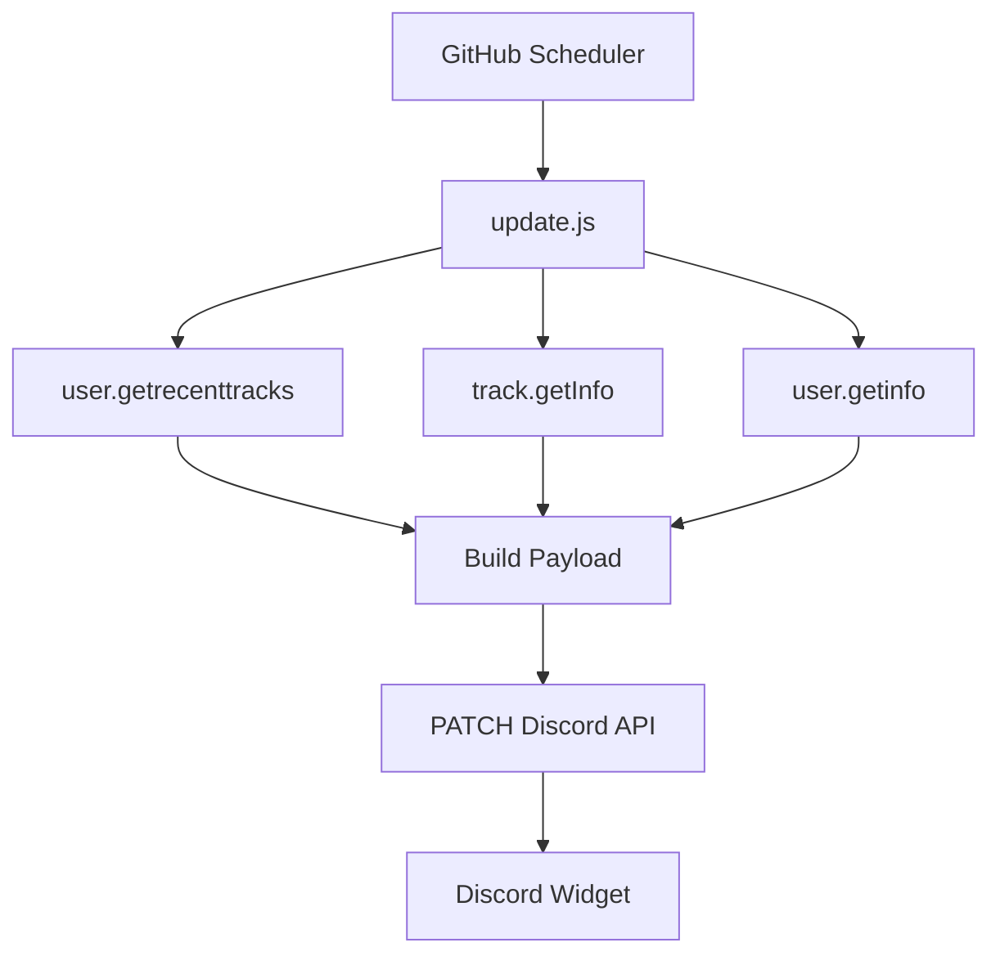
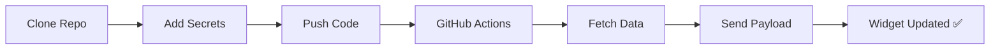

# 🎵 Discord Dynamic Profile Widget Engine

> **Real-Time Last.fm Powered Discord Widget Automation using GitHub Actions**

A cloud-based automation system that connects **Last.fm listening activity** with Discord’s **Dynamic Profile Widget system**, automatically displaying live music data directly on a Discord profile.

This project fetches real-time music data from Last.fm, transforms it into Discord-compatible payloads, and continuously updates a profile widget via GitHub Actions.

---

## ✨ Overview

This project creates an automated Discord widget that displays live listening activity and music statistics.

The system continuously syncs Last.fm data without requiring any local machine, VPS, or persistent backend.

### ✅ Features

- 🎵 Current Track, Artist, Album, Status
- 🖼 Album Artwork
- 📊 Track Listener Count
- 📈 Total Personal Scrobbles
- ⚡ Fully automated updates

### 🏗 Infrastructure

- GitHub Actions
- Node.js
- Discord Widget API
- Last.fm API
- REST API Automation

> ✅ No VPS  
> ✅ No server  
> ✅ No 24/7 runtime  
> ✅ Runs entirely on GitHub Actions

---

## 🎧 What This Widget Displays

### Live Music Metadata

- Track Name
- Artist Name
- Album Name
- Status (LIVE / IDLE)
- Album Artwork

**Example**
```txt
TRACK      → DARE
ARTIST     → Gorillaz
ALBUM      → Demon Days
STATUS     → LIVE
```

---

### 📊 Music Statistics

- Global Track Listener Count
- Total User Scrobbles

**Example**
```txt
LISTENERS  → 28.4K
SCROBBLES  → 23.0K
```

---

## 🏗 System Architecture



---

## ⚙️ How It Works

1. GitHub scheduler triggers workflow
2. Temporary runner starts
3. Node.js environment initializes
4. `update.js` executes
5. Fetch current track
6. Fetch listener count
7. Fetch total scrobbles
8. Build JSON payload
9. PATCH Discord API
10. Widget updates

---

## 🌐 APIs Used

### 🎵 Last.fm API

Docs: https://www.last.fm/api

#### Endpoints

```bash
user.getrecenttracks
track.getInfo
user.getinfo
```

---

### 💬 Discord Widget API

```bash
PATCH https://discord.com/api/v9/applications/{APP_ID}/users/{USER_ID}/identities/0/profile
```

### Headers
```json
{
  "Authorization": "Bot YOUR_BOT_TOKEN",
  "Content-Type": "application/json"
}
```

---

## 📦 Payload Example

```json
{
  "data": {
    "dynamic": [
      { "type": 1, "name": "track", "value": "DARE" },
      { "type": 1, "name": "artist", "value": "Gorillaz" },
      { "type": 1, "name": "album", "value": "Demon Days" },
      { "type": 1, "name": "status", "value": "LIVE" },
      { "type": 1, "name": "listeners", "value": "28.4K" },
      { "type": 1, "name": "scrobbles", "value": "23.0K" },
      {
        "type": 3,
        "name": "album_art",
        "value": { "url": "https://..." }
      }
    ]
  }
}
```

---

## ⚠️ Engineering Discovery

During development, a multi-workflow architecture was tested.

### ❌ Problem
Discord does **not merge partial updates**.

- Second PATCH replaces entire payload
- Missing fields get deleted

### ✅ Final Solution

- Single workflow
- Single updater
- Full payload every time

---

## 🤖 GitHub Actions

### Workflow
```
.github/workflows/update.yml
```

### Schedule
```yaml
schedule:
  - cron: "*/5 * * * *"
```

---

## 📂 Project Structure

```
discord-lastfm-widget/
├── package.json
├── update.js
└── .github/
    └── workflows/
        └── update.yml
```

---

## 🔐 Required Secrets

Path:
```
Settings → Secrets → Actions
```

```
LASTFM_API_KEY
LASTFM_USERNAME
DISCORD_APP_ID
DISCORD_USER_ID
DISCORD_BOT_TOKEN
```

---

## 🚀 Deployment



---

## 🧠 Development Journey

Tested architectures:

- Single workflow
- Multi-workflow
- Cloudflare Workers
- Railway
- Render

### Challenges

- Discord API 400 errors
- Payload overwrite behavior
- GitHub cron limitations

---

## 📚 References

- https://youtu.be/gYv7D83u7yQ
- https://chloecinders.com/blog/discord-widgets
- https://discord.com/developers/docs
- https://docs.github.com/actions
- https://www.last.fm/api

---

## 🧰 Tech Stack

- Node.js
- GitHub Actions
- Axios
- REST APIs
- Discord API
- Last.fm API

---

## 👤 Author

**Yash Verma**

- GitHub: https://github.com/MeYashverma
- Last.fm: http://last.fm/user/The_Berlin

---

## 📊 Live Stats


